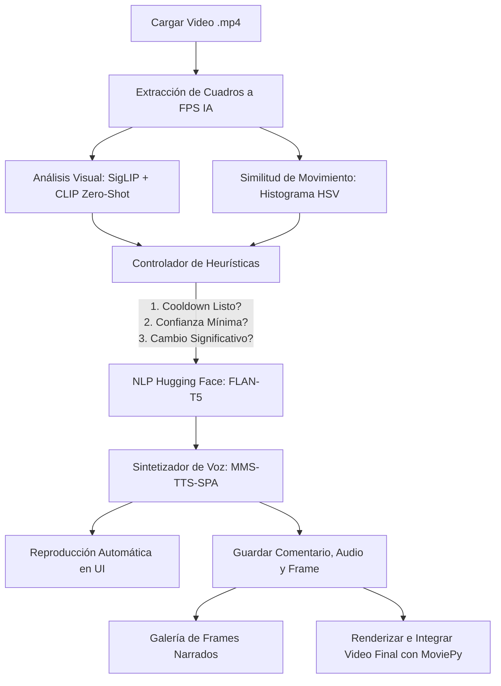

# ComentaristaIA: Narrador de Videojuegos Multimodal

ComentaristaIA es un sistema inteligente multimodal de caster/narrador de videojuegos en español para jugadas grabadas en archivos de video `.mp4`. La aplicación está enfocada en clips de Minecraft y orquesta visión artificial, lenguaje natural, síntesis de voz y reglas heurísticas en una interfaz funcional con Streamlit.

---

## Arquitectura del Sistema

### Arquitectura elegida
Se eligió una arquitectura modular basada en **Opción B de Visión**, usando modelos pre-entrenados de Hugging Face en lugar de entrenar una CNN propia. La aplicación está dividida en cuatro capas principales:

* **Captura y procesamiento de video**: `app.py` recibe un archivo `.mp4`, lo lee con OpenCV y extrae frames a una frecuencia configurable.
* **Visión artificial**: `ia_engine.py` clasifica cada frame con un ensemble SigLIP + CLIP usando prompts descriptivos especializados en Minecraft.
* **Narración y voz**: `ia_engine.py` transforma el estado detectado en comentario con FLAN-T5 y lo sintetiza con MMS-TTS en español.
* **Control heurístico y exportación**: `utils.py` calcula similitud visual, suaviza predicciones y mezcla los audios generados con el video original usando MoviePy.

El flujo del sistema integra visión artificial, procesamiento heurístico lógico y síntesis de voz mediante los siguientes módulos comunicados de forma asíncrona y reactiva:



### 1. Modelos de Inteligencia Artificial (Hugging Face)
* **Visión (SigLIP + CLIP Large)**: Usamos `google/siglip-so400m-patch14-384` como modelo principal y `openai/clip-vit-large-patch14` como segundo voto de ensemble. El motor compara cada frame contra prompts descriptivos por videojuego, agrega el score por categoría y aplica pesos/umbrales para reducir falsos positivos en estados raros.
* **Lenguaje / Narración (FLAN-T5)**: Usamos `google/flan-t5-small` con `pipeline("text2text-generation")` para convertir el estado detectado en una frase breve de comentarista en español. Si el modelo no está disponible o genera texto fuera de contexto, la app cae a plantillas de respaldo.
* **Audio / Voz (MMS-TTS)**: Usamos el modelo `facebook/mms-tts-spa` de Meta optimizado para español. Este modelo de Text-to-Speech genera archivos `.wav` que se reproducen en la app y después se pueden mezclar con el video original.

### 2. Lógica de Control (Heurísticas en `utils.py`)
Para evitar que el narrador hable continuamente o repita comentarios ante escenas estáticas:
* **Filtro de Similitud HSV**: Compara los histogramas HSV de dos frames consecutivos. Si la correlación supera el umbral (por defecto `95%`), el frame se ignora porque no hay cambios significativos de acción.
* **Manejador de Cooldown**: Se establece un tiempo de espera (por defecto `8s`) entre audios para evitar solapamientos.
* **Confianza mínima y suavizado**: Se promedian las últimas 3 predicciones para evitar saltos por ruido. Además, la app solo comenta si la confianza supera el umbral configurado.
* **Clasificación multicrop**: Para Minecraft se evalúa el frame completo, una zona sin hotbar y recortes centrados en la mira. Esto mejora la detección de bloques/minerales porque el modelo mira donde normalmente actúa el jugador.
* **Disparador por Cambio de Estado**: Si el modelo detecta que el estado cambió con suficiente confianza (ej. de *Exploración* a *Combate*), se genera un comentario sin hablar en cada frame.
* **Reconocimiento extendido para Minecraft**: La app está enfocada en Minecraft y distingue acciones como `talar`, `crafteo`, `fundición`, `cultivo`, `pesca`, `ganadería`, `cofre`, `encantamiento`, `pociones`, `comer`, `dormir`, `nadar`, `bote`, `portal`, `nether`, `aldea`, `comercio` y minería específica por mineral: carbón, hierro, cobre, oro, redstone, lapislázuli, diamante, esmeralda y escombros ancestrales.

### 3. Interfaz y Galería de Evidencia
La interfaz en `app.py` permite subir un video `.mp4`, ejecutar el análisis, escuchar la narración y consultar una galería desplegable con los frames exactos donde habló el narrador. Cada elemento de la galería muestra el minuto del video, la captura del frame y el comentario generado.

### 4. Mezcla Final de Narración
Al finalizar la transmisión de análisis, la aplicación permite exportar el video original. El script utiliza `MoviePy` para calcular el posicionamiento temporal exacto de los audios `.wav` generados y mezclarlos sobre la pista de audio original del juego (cuyo volumen se atenúa para asegurar que la voz del narrador se escuche de forma clara y nítida).

---

## Estructura del Proyecto

```text
ComentaristaIA/
├── app.py              # Interfaz Streamlit y flujo principal de procesamiento
├── ia_engine.py        # Modelos Hugging Face: visión, NLP y TTS
├── utils.py            # Video, similitud HSV, suavizado y mezcla con MoviePy
├── requirements.txt    # Dependencias del proyecto
├── README.md           # Documentación de arquitectura y ejecución
├── temp_audio/         # Audios temporales generados durante la narración
└── temp_frames/        # Frames donde habló el narrador
```

* **[app.py](app.py)**: Interfaz Streamlit. Administra la carga del video, el bucle de análisis, la reproducción de voz, la galería de frames narrados y la exportación final.
* **[ia_engine.py](ia_engine.py)**: Orquestador de modelos Hugging Face. Carga SigLIP/CLIP, FLAN-T5 y MMS-TTS; clasifica escenas de Minecraft y genera comentarios.
* **[utils.py](utils.py)**: Utilidades para metadatos de video, comparación de histogramas HSV, suavizado de predicciones y mezcla final de audio/video.
* **[requirements.txt](requirements.txt)**: Lista de dependencias del entorno de ejecución.

---

## Requisitos e Instalación

### Requisitos Previos
* **Python**: `3.10` a `3.13` (El entorno se configuró con Python 3.13).
* **NVIDIA GPU**: Recomendado GeForce RTX (el proyecto corre en una **RTX 4060 Ti con 8GB VRAM** con soporte para CUDA).

### Configuración e Instalación
El entorno ya está creado y configurado en tu directorio. Si necesitas volver a configurar el entorno virtual, corre:

```powershell
# Crear entorno virtual
py -m venv venv

# Activar entorno
.\venv\Scripts\Activate.ps1

# Instalar dependencias
pip install -r requirements.txt
```

---

## 🎮 Ejecución

Para iniciar la aplicación, ejecuta el siguiente comando desde la raíz del proyecto:

```powershell
.\venv\Scripts\python -m streamlit run app.py
```

La consola te proporcionará una URL local (normalmente `http://localhost:8501`) donde podrás interactuar con la interfaz del sistema.

### Pasos de Uso en la App:
1. **Sube tu video** `.mp4` de gameplay en la barra lateral izquierda.
2. Ajusta **Confianza mínima para comentar** si el video tiene overlays, baja calidad o escenas oscuras. Un valor más alto reduce comentarios equivocados; uno más bajo hace que el bot hable más.
3. Haz clic en **🎙️ Iniciar Transmisión y Narración** para procesar el video.
4. Observa el análisis en tiempo real en la pantalla izquierda y la consola del caster en la derecha.
5. Abre **Frames donde habló el narrador** para revisar la galería de capturas y comentarios generados.
6. Al finalizar, ajusta el volumen del juego de fondo y haz clic en **🚀 Renderizar Video Final** para descargar tu gameplay con la voz de la IA integrada.
